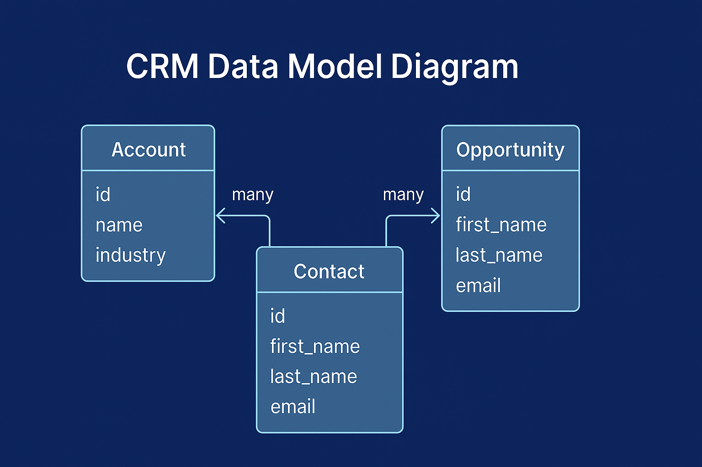

---
# CRM Data Model Blueprint


This repository provides a modular, scalable **CRM data model blueprint** designed for SaaS solutions, system integrators, and architecture teams. It includes JSON schema definitions, a visual ERD diagram, and architecture decision records to accelerate data strategy and implementation planning.

> ✅ Built for technical reviewers, hand-off readiness, and long-term maintainability.

---

## 🔍 Overview
This project is ideal for:
- **CTOs or technical leads** architecting a new CRM platform
- **Freelance developers** needing a clear data model for clients
- **Teams managing existing CRM systems** migrating to SaaS platforms

The blueprint includes:
- ✅ Validated JSON Schemas for `Account`, `Contact`, `Lead`, and `Opportunity`
- ✅ A Mermaid.js-powered data model diagram (`/diagrams/diagram.md`)
- ✅ Architecture decisions tracked in `/docs/architecture_decisions.md`

---

## 📁 Folder Structure
```
crm-data-model-blueprint/
├── diagrams/                 # Mermaid diagrams for entity relationships
├── docs/                     # Architecture decision documentation
├── schemas/                  # JSON Schema files for CRM entities
├── README.md
├── LICENSE
```

---

## 🛠️ Usage Instructions
1. Clone the repository:
   ```bash
   git clone https://github.com/visaoenhance/crm-data-model-blueprint.git
   ```

2. View the schema definitions in `/schemas`
3. Open `/diagrams/diagram.md` to view the visual entity relationships
4. Review `/docs/architecture_decisions.md` for design justification

---

## 📊 Preview Diagram
> 📌 *Rendered via Mermaid in compatible markdown tools:*



---

## 💡 License
This project is licensed under the MIT License - see the [LICENSE](./LICENSE) file for details.

---

## 🔗 Related Projects
Stay tuned! Future blueprints will include:
- Databricks AI Integration Model
- Resume Parsing Flow Blueprint
- Secure Frontend/API/Data Pipelines

---

## 🤝 Contributing
Have a suggestion or use case to add? Open an issue or pull request. Contributions are welcome!

